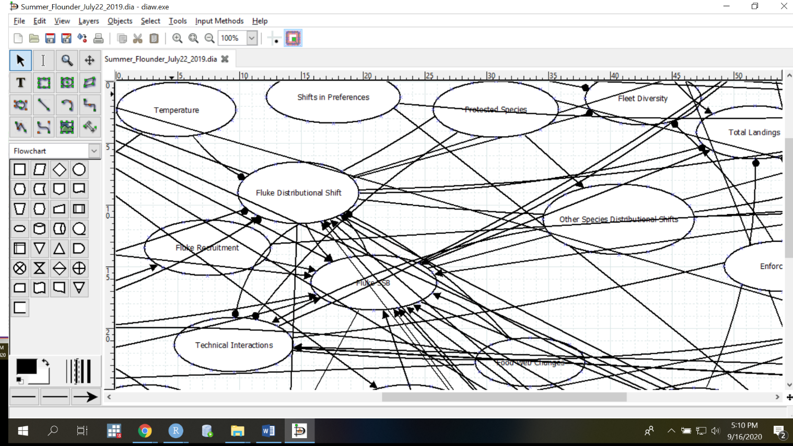
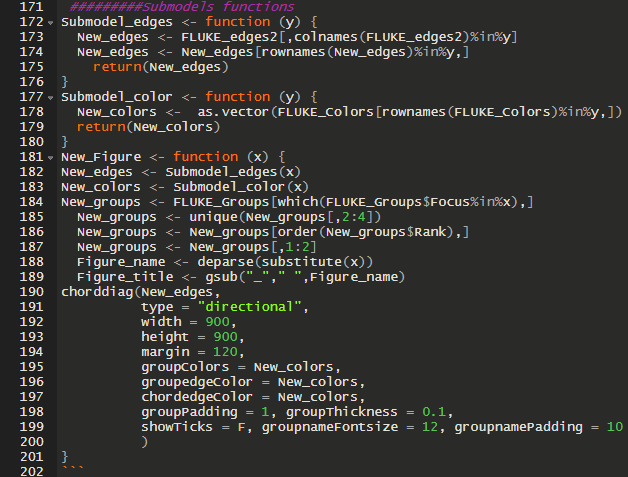
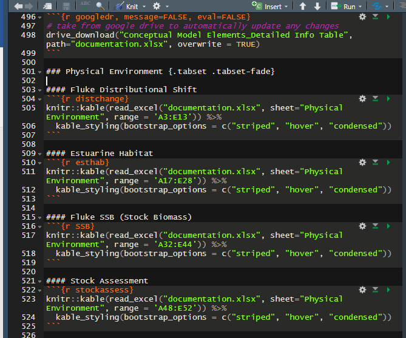
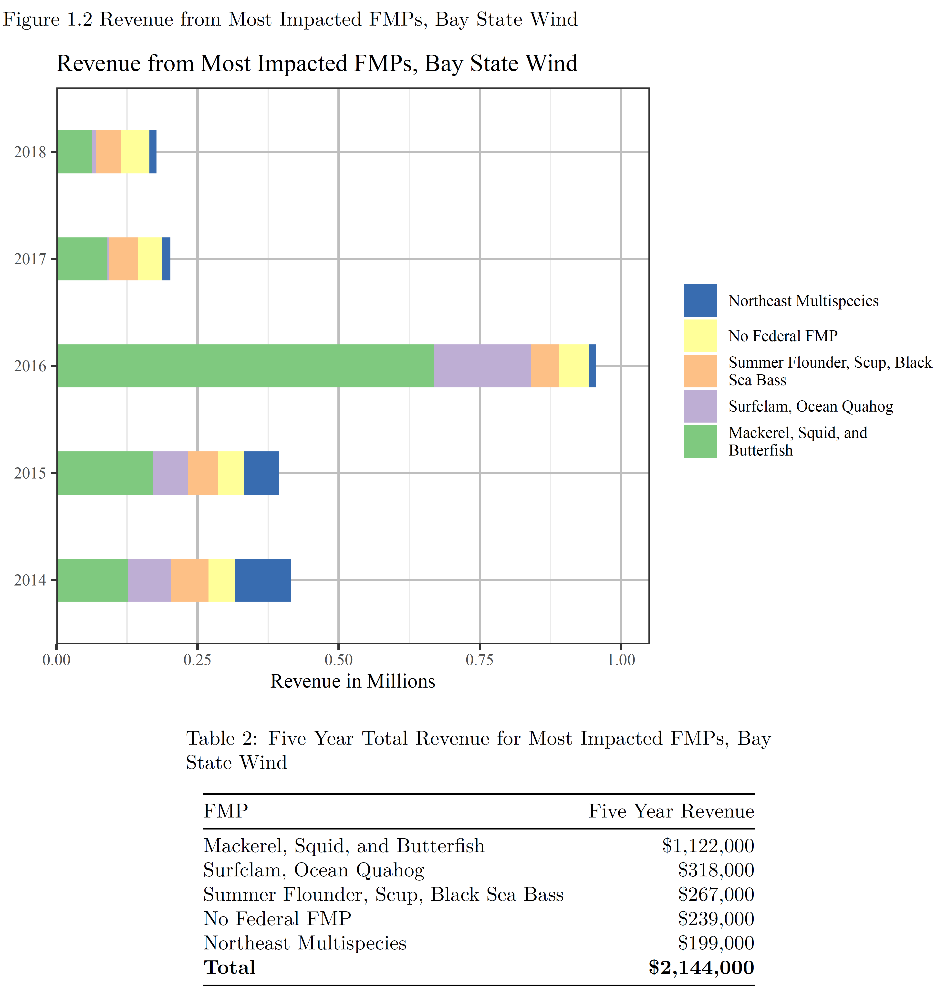

class: top, left

```{r setup, include=FALSE}

options(htmltools.dir.version = FALSE)
knitr::opts_chunk$set(echo = F,
                      warning = F,
                      message = F)
#Plotting and data libraries
library(dplyr)
library(tidyr)
library(here)
library(kableExtra)
library(ggrepel)
library(stringr)
library(patchwork)
library(grid)
library(plotly)
library(vegan)
library(rpart)
library(googledrive)
library(readxl)
library(kableExtra)
library(DT)


data.dir <- here::here("data")

```

# Mid-Atlantic Fishery Management Council Request:
<br />
<br />
<br />
## [A conceptual model for summer flounder fishery-ecosystem interactions, inventory of data availability and gaps, applicable models, and example management questions which could be addressed with this knowledge base.](https://gdepiper.github.io/Summer_Flounder_Conceptual_Models/sfconsmod_riskfactors_subplots.html)

Transition from risk assessment to Management Strategy Evaluation

Credit where credit is due: Sarah Gaichas at NEFSC developed most of the R Markdown code & made the conceptual model interactive
???
---
# Orientiation

## What this talk will do:

- Walk through decision points which facilitated use of R & R Markdown

## What this talk won't do:

- Review every line of code used to develop the HTML file

  + That code can be found here: <br />
    https://github.com/gdepiper/Summer_Flounder_Conceptual_Models.git
    
- Serve solely as an introduction to R Markdown

  + Better resources available
  
      + e.g. https://rmarkdown.rstudio.com/lesson-1.html
    
## The hope is to present the utility of collaborating in R, particularly for projects with ill-defined needs and products, necessitating substantial collaboration, or with recurring production needs.
???
---
# First thing first...what is R Markdown?

.pull-left[R port of Markdown language
  
- Plain text HTML editor with added functionality
  
  + Extended to generate PDF & Word documents
  
    + Some LaTeX, BibTeX, & Beamer functionality
    
  + Code can be executed directly in the markdown file]
  
  .pull-right[
```{r RMarkdownfig, echo=TRUE, eval=TRUE, fig.width=5,fig.height=5.5, fig.align="center"}
  n=1000 
  y=rnorm(n) #Drawing 1,000 random observations ~ N(0,1)
  y_density <- density(y)
  plot(y_density,main="Integrating code is extremely useful!")
  
```
]

???
---
# Our team was asked specifically for a conceptual model

.pull-left[Many software available

- [Used Dia](http://dia-installer.de/)
  
  + Free
    
  + Fast
    
  + Can easily import adjacency matrix into R using the [Qpress Package](https://github.com/SWotherspoon/QPress)
    
    + Increases functionality immensely
    
    + Need [devtools package](https://cran.r-project.org/web/packages/devtools/index.html)
]
      
.pull-right[


.image-cap[Dia software user interface.
]
]

???
---
# Model linkages quickly became hard to trace

.pull-left[Work Group decided a few steps would facilitate communication

- Fix 1: Sub-models to focus on key relationships
  
  + Based on pre-determined focal components
    
  + Function pulls relevant linkages only]
    
.pull-right[


.image-cap[Submodel function easily creates subsets of data for submodel rendering.
]
]

???
---
# Model linkages quickly became hard to trace

.pull-left[Work Group decided a few steps would facilitate communication

- Fix 2: Interactive model

  + [chorddiag package](https://github.com/mattflor/chorddiag)
  
    + Need [devtools package](https://cran.r-project.org/web/packages/devtools/index.html) 
    
  + More easily trace linkages
    
  + Added benefit: reproducible in html slides!
  
  ]

.pull-right[


.image-cap[Static conceptual model image.
]
]
???
---
```{r sfconceptmod, echo = F, fig.align = "center"}
# setup for conceptual model
PKG <- c(#"foreign","foodweb","sna", "DiagrammeR","circlize", "kableExtra", "googledrive", "readxl"
         "RColorBrewer","QPress",
         "chorddiag",
         "widgetframe")

for (p in PKG) {
  if(!require(p,character.only = TRUE)) {
    install.packages(p)
    require(p,character.only = TRUE)}
}


#assumes this is a project and .dia file is in data directory
edges <- model.dia(file.path(data.dir, "Summer_Flounder_July22_2019.dia"))

source("R/interactive_chord_sfconsmod.R")

conmod <- interactive_chord_sfconsmod(edges, width=650, height=650, margin=190)

frameWidget(conmod)

```
???
In this interactive circular graph visualization, model elements identified as important by the Council (through risk assessment) and by the working group (through a range of experience and expertise) are at the perimeter of the circle. Elements are defined in detail in the last section of [this page](https://gdepiper.github.io/Summer_Flounder_Conceptual_Models/sfconsmod_riskfactors_subplots.html). Relationships between elements are represented as links across the center of the circle to other elements on the perimeter. Links from a model element that affect another element start wide at the base and are color coded to match the category of the element they affect.Hover over a perimeter section (an element) to see all relationships for that element, including links from other elements. Hover over a link to see what it connects. Links by default show text for the two elements and the direction of the relationship (1 for relationship, 0 for no relationship--most links are one direction).For example, hovering over the element "Total Landings" in the full model shows that the working group identified the elements affected by landings as Seafood Production, Recreational Value, and Commercial Profits (three links leading out from landings), and the elements affecting landings as Fluke SSB, Fluke Distributional Shift, Risk Buffering, Management Control, Total Discards, and Shoreside Support (6 links leading into Total Landings).


???
---
## Our team was asked specifically for a gap analysis

## Documentation is also key to scientific method

- Transparency & Reproducibility 

  + Each link documented
    
#### Allocation
```{r alloc}
knitr::kable(read_excel("documentation.xlsx", sheet="Human Dimension", range = 'A3:E9')) %>%
  kable_styling(bootstrap_options = c("striped", "hover", "condensed"))
```


???
---

## Our team was asked specifically for a gap analysis

## Documentation is also key to scientific method


.pull-left[Google Sheets used to develop documentation

- Facilitates collaborative development
  
- Can easily import Google Sheets into R using the [googledrive](https://googledrive.tidyverse.org/) package
  
  + Change Google Sheet, then automatically propogates
    
  + Authorize by typing drive_find(n_max=30) into command line after package installation
    ]
    
.pull-right[


.image-cap[Code pulling Google Sheet into memory, savig it as an Excel file, and then creating HTML table from the Excel file.
]
]

???
---
## After preliminary presentation to the Council, a list of definitions was requested [DT Package](https://rstudio.github.io/DT/)


```{r deftable}

#knitr::kable(read.csv("definitions.csv")) %>%
#  kable_styling(bootstrap_options = c("striped", "hover", "condensed"))

datatable(read.csv("definitions.csv"), rownames = FALSE, options = list(pageLength = 3))
```
???
---
# Collaboration facilitated through GitHub

[GitHub is integrated into RStudio](https://happygitwithr.com/rstudio-git-github.html)

- Allows version control
  
  + Everyone works off of the same version of the code
  
    + Including all files needed to create products
  
  + Ensures the code can always be reverted to a point at which it worked
  
- GitHub will also host your web pages for free!

  + [GitHub Pages](https://pages.github.com/)
  
  + Code pushed to site, and with some file folder housekeeping, HTML is rendered
  
    + Near-real time product updating
  
    + Warning: Not intuitive for those unfamiliar with HTML
  
???
---
# Ease of customization for alternate needs

[Presentation of the results of the work group to the MAFMC used different visual representation of the conceptual model](https://gdepiper.github.io/Summer_Flounder_Conceptual_Models/sfconsmod_final_2col.html)

Allowed work group to walk through top 3 questions with visual representation to discuss relevant ecosystem linkages.

FYI - the Council chose question 3 to develop a Management Strategy Evaluation around. Work is currently underway.
???
---
## Added benefits of using R and R Markdown

.pull-left[Seamless integration of analysis and final products

  + Great for reports, etc. which need to be updated regularly
  
    + Offshore Wind in the Northeast Atlantic LME
    
      + Currently 27 lease areas
      
      + Frequent requests for information
      
      + Standardized & Automated (Dynamic) reporting for Impact Analysis
      
      + Alternative text for 508 compliance (HTML)
]
.pull-right[

]

???
---
# In Conclusion...

R and R Markdown are great resources, particularly for:

- Recurring reporting needs

- Collaboration

- Projects with undefined products

However, there's still value in other software/languages
???
---
# Questions? Thank you!


* [Mid-Atlantic Council Summer Flounder conceptual model, support tables](https://gdepiper.github.io/Summer_Flounder_Conceptual_Models/sfconsmod_riskfactors_subplots.html)

* [Management questions and conceptual model](https://gdepiper.github.io/Summer_Flounder_Conceptual_Models/sfconsmod_final_2col.html) 
  
* Slides available at https://gdepiper.github.io/RWorkshopSocialsci_GD/

.pull-left[
Contacts:  
]
.pull-right[
geret.depiper@noaa.gov

sarah.gaichas@noaa.gov  

bmuffley@mafmc.org
]